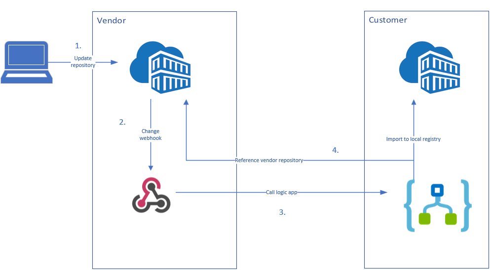

# Azure Container Registry selected synchronisation

Synchronise selected repositories from one Azure container registry to another. This is an implementation where a vendor has some repositories they wish to make available to a customer - where the customer's container registry is not necesarily public-facing.

