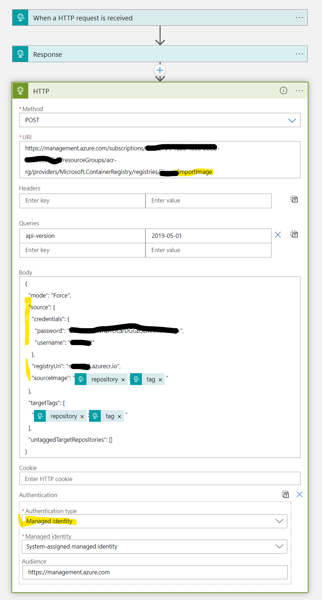

# Azure Container Registry selected synchronisation

Synchronise selected repositories from one Azure container registry to another. This is an implementation where a vendor has some repositories they wish to make available to a customer - where the customer's container registry is not necesarily public-facing.


## Scenario

A vendor wants to supply their software in the form of images to a customer. The vendor only wants to supply selective images and so places these on a public-facing Azure Container Registry (ACR) instance. The customer has an Azure Container Registry and does not want to make this public, nor give any vendor keys to their ACR. But does want to get copies of new images when they become available.

## Implementation

### Vendor Webhook
The vendor's ACR creates a webhook that is triggered when a specific subset of their images on their ACR change. This can be wildcarded.


In the above, the webhook will fire when any repositories of the name "tripinsights/*" are updated. 

The webhook is a URL - in this case the customer's HTTP-triggered logic app.

### Customer's Logic App
The customer's logic app is an HTTP-triggered one that checks the inbound request and then calls an Azure REST call to import the named repository (this is in the body of the webhook trigger) into the customer's ACR.



In the above:
1. The message is parsed using the schema of the webhook https://docs.microsoft.com/en-us/azure/container-registry/container-registry-webhook-reference#push-event
2. A REST request is formed to the Azure ACR REST API https://docs.microsoft.com/en-us/rest/api/containerregistry/registries/import-image?tabs=HTTP#importimagebytag 
3. The repository and tag are extracted from the request.
4. The body needs credentials to the vendor's ACR (this are inserted inline)
5. The REST request itself (to import to the customer's ACR), requires authentication. This is done via a managed identity of the logic app - which has access rights to the customer's ACR.

The code of the logic app is:

```
{
    "definition": {
        "$schema": "https://schema.management.azure.com/providers/Microsoft.Logic/schemas/2016-06-01/workflowdefinition.json#",
        "actions": {
            "HTTP": {
                "inputs": {
                    "authentication": {
                        "audience": "https://management.azure.com",
                        "type": "ManagedServiceIdentity"
                    },
                    "body": {
                        "mode": "Force",
                        "source": {
                            "credentials": {
                                "password": "VENDORS-ACR-PASSWORD",
                                "username": "VENDORS-ACR-USERNAME"
                            },
                            "registryUri": "VENDORS-ACR-NAME.azurecr.io",
                            "sourceImage": "@{triggerBody()?['target']?['repository']}:@{triggerBody()?['target']?['tag']}"
                        },
                        "targetTags": [
                            "@{triggerBody()?['target']?['repository']}:@{triggerBody()?['target']?['tag']}"
                        ],
                        "untaggedTargetRepositories": []
                    },
                    "method": "POST",
                    "queries": {
                        "api-version": "2019-05-01"
                    },
                    "uri": "https://management.azure.com/subscriptions/CUSTOMERS-SUBSCRIPTION/resourceGroups/CUSTOMERS-ACR-RESOURCE-GROUP/providers/Microsoft.ContainerRegistry/registries/CUSTOMERS-ACR-NAME/importImage"
                },
                "runAfter": {
                    "Response": [
                        "Succeeded"
                    ]
                },
                "type": "Http"
            },
            "Response": {
                "inputs": {
                    "statusCode": 200
                },
                "kind": "Http",
                "runAfter": {},
                "type": "Response"
            }
        },
        "contentVersion": "1.0.0.0",
        "outputs": {},
        "parameters": {},
        "triggers": {
            "manual": {
                "inputs": {
                    "schema": {
                        "properties": {
                            "action": {
                                "type": "string"
                            },
                            "id": {
                                "type": "string"
                            },
                            "request": {
                                "properties": {
                                    "host": {
                                        "type": "string"
                                    },
                                    "id": {
                                        "type": "string"
                                    },
                                    "method": {
                                        "type": "string"
                                    },
                                    "useragent": {
                                        "type": "string"
                                    }
                                },
                                "type": "object"
                            },
                            "target": {
                                "properties": {
                                    "digest": {
                                        "type": "string"
                                    },
                                    "length": {
                                        "type": "integer"
                                    },
                                    "mediaType": {
                                        "type": "string"
                                    },
                                    "repository": {
                                        "type": "string"
                                    },
                                    "size": {
                                        "type": "integer"
                                    },
                                    "tag": {
                                        "type": "string"
                                    }
                                },
                                "type": "object"
                            },
                            "timestamp": {
                                "type": "string"
                            }
                        },
                        "type": "object"
                    }
                },
                "kind": "Http",
                "type": "Request"
            }
        }
    },
    "parameters": {}
}
```

### Security Model

In this example:
1. the customer does not have to give any access to their ACR to the vendor.
2. Only the customer's logic app has access to the customer's ACR - via the logic app's managed identity
3. The logic app's URL is given to the vendor - with all of the tokens on the URL line.
4. The logic app could also validate the contents of the webhook body to reject image names they should not have received
5. The vendor needs to get the access keys of their ACR to the customer. This could be a concern, but the vendor could have an ACR instance per customer to make sure that only that customer's images will be visible to that customer.

## Further Enhancements

The overall security model could be improved for both the customer and vendor by:

1. Restricting the logic app to only accept HTTP requests from known IP addresses.
2. Restricting the visibility of the vendor's IP addresses from know networks (this can be IP address restriction or private endpoints https://docs.microsoft.com/en-gb/azure/container-registry/container-registry-access-selected-networks but this will require the Premium version of ACR.


# Summary

This is a simple parttern to allow a vendor to share a subset of their images with a specific customer - keeping these two isolated. In later versions of ACR, there will be a feature called "Connected Registry" https://docs.microsoft.com/en-us/azure/container-registry/intro-connected-registry , which will allow this to be done more declaratively. This will also require the Premium service tier of ACR.
