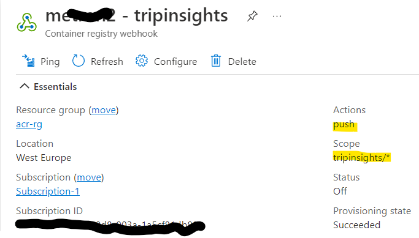

# Azure Container Registry selected synchronisation

Synchronise selected repositories from one Azure container registry to another. This is an implementation where a vendor has some repositories they wish to make available to a customer - where the customer's container registry is not necesarily public-facing.


## Scenario

A vendor wants to supply their software in the form of images to a customer. The vendor only wants to supply selective images and so places these on a public-facing Azure Container Registry (ACR) instance. The customer has an Azure Container Registry and does not want to make this public, nor give any vendor keys to their ACR. But does want to get copies of new images when they become available.

## Implementation

### Vendor Webhook
The vendor's ACR creates a webhook that is triggered when a specific subset of their images on their ACR change. This can be wildcarded.



In the above, the webhook will fire when any repositories of the name "tripinsights/*" are updated. 

The webhook is a URL - in this case the customer's HTTP-triggered logic app.

### Customer's Logic App
The customer's logic app is an HTTP-triggered one that checks the inbound request and then calls an Azure REST call to import the named repository (this is in the body of the webhook trigger) into the customer's ACR.


In the above:
1. The message is parsed using the schema of the webhook 
2. A REST request is formed to the Azure ACR REST API https://docs.microsoft.com/en-us/rest/api/containerregistry/registries/import-image?tabs=HTTP#importimagebytag 
3. The repository and tag are extracted from the request.
4. The body needs credentials to the vendor's ACR (this are inserted inline)
5. The REST request itself (to import to the customer's ACR), requires authentication. This is done via a managed identity of the logic app - which has access rights to the customer's ACR.

The code of the logic app is:

```
{
    "definition": {
        "$schema": "https://schema.management.azure.com/providers/Microsoft.Logic/schemas/2016-06-01/workflowdefinition.json#",
        "actions": {
            "HTTP": {
                "inputs": {
                    "authentication": {
                        "audience": "https://management.azure.com",
                        "type": "ManagedServiceIdentity"
                    },
                    "body": {
                        "mode": "Force",
                        "source": {
                            "credentials": {
                                "password": "VENDORS-ACR-PASSWORD",
                                "username": "VENDORS-ACR-USERNAME"
                            },
                            "registryUri": "VENDORS-ACR-NAME.azurecr.io",
                            "sourceImage": "@{triggerBody()?['target']?['repository']}:@{triggerBody()?['target']?['tag']}"
                        },
                        "targetTags": [
                            "@{triggerBody()?['target']?['repository']}:@{triggerBody()?['target']?['tag']}"
                        ],
                        "untaggedTargetRepositories": []
                    },
                    "method": "POST",
                    "queries": {
                        "api-version": "2019-05-01"
                    },
                    "uri": "https://management.azure.com/subscriptions/CUSTOMERS-SUBSCRIPTION/resourceGroups/CUSTOMERS-ACR-RESOURCE-GROUP/providers/Microsoft.ContainerRegistry/registries/CUSTOMERS-ACR-NAME/importImage"
                },
                "runAfter": {
                    "Response": [
                        "Succeeded"
                    ]
                },
                "type": "Http"
            },
            "Response": {
                "inputs": {
                    "statusCode": 200
                },
                "kind": "Http",
                "runAfter": {},
                "type": "Response"
            }
        },
        "contentVersion": "1.0.0.0",
        "outputs": {},
        "parameters": {},
        "triggers": {
            "manual": {
                "inputs": {
                    "schema": {
                        "properties": {
                            "action": {
                                "type": "string"
                            },
                            "id": {
                                "type": "string"
                            },
                            "request": {
                                "properties": {
                                    "host": {
                                        "type": "string"
                                    },
                                    "id": {
                                        "type": "string"
                                    },
                                    "method": {
                                        "type": "string"
                                    },
                                    "useragent": {
                                        "type": "string"
                                    }
                                },
                                "type": "object"
                            },
                            "target": {
                                "properties": {
                                    "digest": {
                                        "type": "string"
                                    },
                                    "length": {
                                        "type": "integer"
                                    },
                                    "mediaType": {
                                        "type": "string"
                                    },
                                    "repository": {
                                        "type": "string"
                                    },
                                    "size": {
                                        "type": "integer"
                                    },
                                    "tag": {
                                        "type": "string"
                                    }
                                },
                                "type": "object"
                            },
                            "timestamp": {
                                "type": "string"
                            }
                        },
                        "type": "object"
                    }
                },
                "kind": "Http",
                "type": "Request"
            }
        }
    },
    "parameters": {}
}
```
